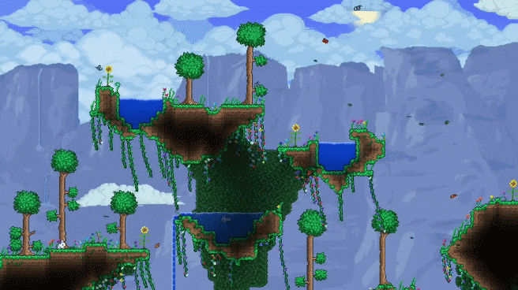

# Ploterraria
This is a plotting website that allows for custom comparisons of Terraria items based on selected axis stats.

## Sources
All images and stats are scraped from [Official Terraria Wiki](https://terraria.wiki.gg/). This data is licensed under the [Creative Commons Attribution-NonCommercial-ShareAlike 4.0 License](https://creativecommons.org/licenses/by-nc-sa/4.0/).
Any data obtained using software from this repository also falls under this license. GIF at top of ReadMe was sourced [here](https://steamcommunity.com/sharedfiles/filedetails/?id=1461467525).
